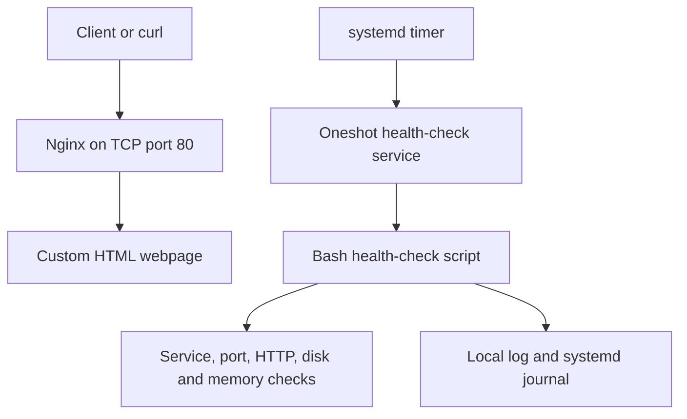

# Linux Server Operations and Troubleshooting Lab

## Project Overview

This hands-on project demonstrates the deployment, operation, monitoring, automation and troubleshooting of an Nginx web server on Ubuntu Linux.

I built this project to strengthen practical skills for Cloud Support, Linux Support, Infrastructure Support and Cloud Operations roles. It combines Linux administration and Bash automation with my professional experience in incident management, technical support, SLA handling and stakeholder communication.

This is a self-directed lab project and does not claim professional production Linux or cloud-administration experience.

## Architecture



## Environment and Tools

- Windows 11 host
- WSL 2
- Ubuntu Linux
- systemd
- Nginx 1.18.0
- Bash
- Git and GitHub
- curl
- Linux networking and resource-monitoring utilities

## Project Features

### Nginx Web Server

- Installed and operated Nginx on Ubuntu.
- Deployed a custom HTML webpage.
- Preserved the original webpage for rollback.
- Managed Nginx using systemd.
- Verified Nginx master and worker processes.
- Confirmed IPv4 and IPv6 listeners on TCP port 80.
- Tested HTTP availability using curl.
- Reviewed access logs, error logs and systemd journals.

### Automated Bash Health Check

The health-check script monitors:

- Actual Nginx service state
- TCP port 80 listener
- HTTP response status
- Root-filesystem usage
- Memory usage
- Overall server health

The script also:

- Uses configurable disk and memory thresholds.
- Returns exit code `0` for healthy results.
- Returns exit code `1` when one or more checks fail.
- Records timestamps.
- Displays results in the terminal.
- Appends standard output and errors to a local log.
- Determines its own project directory.
- Creates the monitoring directory when required.
- Works when executed outside the repository directory.

Script: [server-health-check.sh](scripts/server-health-check.sh)

### Scheduled Monitoring

A systemd oneshot service executes the Bash health check.

A systemd timer:

- Starts automatically with systemd.
- Runs the health check every five minutes.
- Records execution history in the systemd journal.
- Triggers a catch-up run after a missed schedule when applicable.

Unit files:

- [server-health-check.service](systemd/server-health-check.service)
- [server-health-check.timer](systemd/server-health-check.timer)

### Troubleshooting Runbook

The operational runbook provides a structured response procedure covering:

- Symptom confirmation
- Service-state investigation
- Configuration validation
- Process inspection
- Port inspection
- HTTP testing
- Log analysis
- Safe recovery
- Recovery validation
- Escalation criteria
- Incident closure

Runbook: [Nginx Web Service Outage Runbook](runbooks/nginx-outage-troubleshooting.md)

## Incident Scenarios

### INC-001: Nginx Service Stopped

Nginx was deliberately stopped to simulate complete website unavailability.

Observed symptoms:

- Nginx service became inactive.
- Nginx processes were absent.
- TCP port 80 stopped listening.
- Curl returned connection refused.
- No HTTP response was generated.

Recovery:

- Started Nginx through systemd.
- Confirmed new master and worker processes.
- Verified TCP port 80.
- Confirmed HTTP 200.
- Validated the request through access logs.

Report: [INC-001 — Nginx Service Stopped](incident-reports/INC-001-nginx-service-stopped.md)

### INC-002: Invalid Nginx Configuration

An unsupported directive was added to an included Nginx configuration file. The running service initially continued using its previously loaded configuration, but a restart caused a complete outage because startup validation failed.

Observed symptoms:

- Nginx entered a failed state.
- Port 80 stopped listening.
- Curl returned connection refused.
- The health-check script returned exit code `1`.
- The systemd journal identified the exact file and line containing the invalid directive.
- Disk and memory remained healthy.

Recovery:

- Disabled the invalid configuration file.
- Validated the corrected configuration with `nginx -t`.
- Restarted Nginx.
- Confirmed active service state, HTTP 200 and health-check exit code `0`.

Report: [INC-002 — Invalid Nginx Configuration](incident-reports/INC-002-nginx-invalid-configuration.md)

## Troubleshooting Method

The project uses a layered troubleshooting sequence:

1. Confirm user-facing impact.
2. Check service state.
3. Validate configuration.
4. Check processes.
5. Check listening ports.
6. Test the HTTP endpoint.
7. Review system and application logs.
8. Check disk and memory pressure.
9. Perform a controlled recovery.
10. Validate every affected layer.
11. Document the root cause and preventive actions.

This avoids assuming that an active service alone proves application availability.

## Repository Structure

```text
linux-server-operations/
├── app/
│   └── index.html
├── incident-reports/
│   ├── INC-001-nginx-service-stopped.md
│   └── INC-002-nginx-invalid-configuration.md
├── monitoring/
│   └── health-check.log (generated locally and ignored by Git)
├── runbooks/
│   └── nginx-outage-troubleshooting.md
├── scripts/
│   └── server-health-check.sh
├── systemd/
│   ├── server-health-check.service
│   └── server-health-check.timer
├── .gitignore
└── README.md
```

## Example Health-Check Output

```text
Linux Server Health Check
[OK] nginx service state is active
[OK] TCP port 80 is listening
[OK] Website returned HTTP 200
[OK] Disk usage is below the configured threshold
[OK] Memory usage is below the configured threshold
Overall status: HEALTHY
```

## Skills Demonstrated

- Linux server administration
- Nginx web-server operations
- systemd service management
- systemd timer scheduling
- Bash scripting
- Variables and command substitution
- Conditional logic and numeric comparisons
- Exit-code handling
- File permissions
- Process and socket investigation
- HTTP health checks
- Disk and memory monitoring
- Log analysis
- Configuration validation
- Controlled incident simulation
- Root-cause analysis
- Rollback and recovery
- Runbook creation
- Incident documentation
- Git version control

## Key Lessons

- Service state, process state, port availability and HTTP availability are separate troubleshooting layers.
- A running service can continue using an older valid configuration even when files on disk are invalid.
- Restarting with invalid configuration can convert a configuration defect into an outage.
- Configuration must be validated before reload or restart.
- Monitoring intervals affect how quickly short incidents are detected.
- Recovery must be confirmed technically and documented operationally.

## Current Status

The core Linux Server Operations project is complete.

Potential future enhancements include:

- HTTP 403 file-permission incident
- Port-conflict investigation
- Log rotation
- Alert notification integration
- Remote-host monitoring
